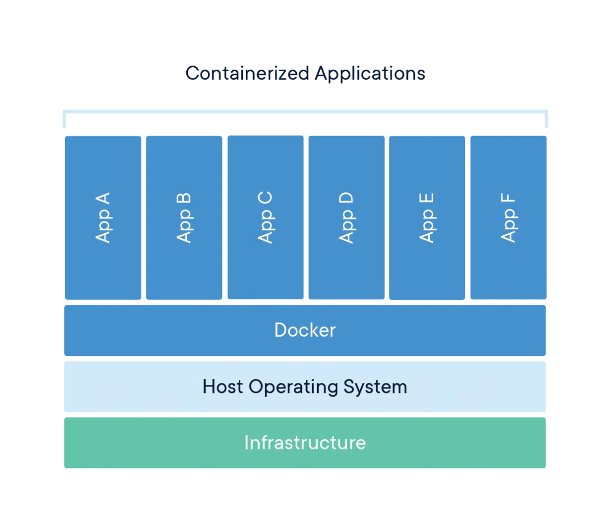
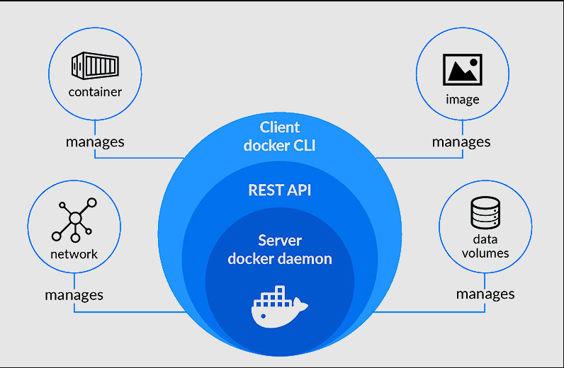

# Inception

this is one of my college projects, to introduce the concept of docker and docker-compose. **THIS IS NOT A GUIDE** this is just my study notes and my understanding of the concept.

## What is Docker?
Docker came to solve the problem of "it works on my machine" by creating a container that can run on any machine that has docker installed, but, in a more technical way, Docker is a tool designed to make it easier to create, deploy, and run applications by using containers.

- **Infrastructure** : it’s our computer components like our CPU and Hard Disk and other physical components.
- **Host Operating System** : Its the OS that our computer is working on like linux or mac os or even windows
- **Docker engine** : this is where the magic happens docker engine is the base engine installed in the host machine to build and run containers using docker components and services, it uses
- **App** : is the container that is running in isolation on the other containers

## How does Docker work?
Docker uses a client-server architecture. The Docker client talks to the Docker daemon, which does the heavy lifting of building, running, and distributing your Docker containers. The Docker client and daemon can run on the same system, or you can connect a Docker client to a remote Docker daemon. The Docker client and daemon communicate using a REST API, over UNIX sockets or a network interface.



Here's how the Docker engine works:

1. You write a Dockerfile, which is a text file that contains the instructions for building a Docker image. A Docker image is a lightweight, stand-alone, executable package that includes everything needed to run a piece of software, including the application code, libraries, dependencies, and runtime.

2. You use the Docker client to build the Docker image by running the docker build command and specifying the path to the Dockerfile. The Docker daemon reads the instructions in the Dockerfile and builds the image.

3. Once the image is built, you can use the Docker client to run the image as a container by using the docker run command. The Docker daemon creates a container from the image and runs the application inside the container.

4. The Docker engine provides a secure and isolated environment for the application to run in, and it also manages resources such as CPU, memory, and storage for the container.

5. You can use the Docker client to view, stop, and manage the containers running on your system. You can also use the Docker client to push the Docker image to a registry, such as Docker Hub, so that it can be shared with others.

## What is a Container?

A container is a standard unit of software that packages up code and all its dependencies so the application runs quickly and reliably from one computing environment to another. A Docker container image is a lightweight, standalone, executable package of software that includes everything needed to run a piece of software, including the code, a runtime, libraries, environment variables, and config files.

## What are Virtual Machines ?

Virtual machines (VMs) are an abstraction of physical hardware turning one server into many servers. The hypervisor allows multiple VMs to run on a single machine. Each VM includes a full copy of an operating system, the application, necessary binaries and libraries – taking up tens of GBs. VMs also slow to boot.

| Virtual Machine | Docker |
| --- | --- |
| Occupy a lot of memory space | Occupy a lot less memory space |
| long time to boot up | quick boot up because it uses the running kernel that you using |
| Difficult to scale up | super easy to scale |
| low efficiency | high efficiency |
| volumes storage cannot be shared across the VM’s  | volumes storage can be shared across the host and the containers |

# Now After we understand what is Docker and how it works now we gonna introduce you to the Dockerfile and Docker-compose file .

- A Dockerfile is a text file that contains the instructions for building a Docker image. It specifies the base image to use, the dependencies and software to install, and any other configurations or scripts that are needed to set up the environment for the application to run.


- A Docker Compose file is a YAML file that defines how multiple Docker containers should be set up and run. It allows you to define the services that make up your application, and then start and stop all of the containers with a single command.

Here are some key differences between a Dockerfile and a Docker Compose file:

1. Purpose: A Dockerfile is used to build a single Docker image, while a Docker Compose file is used to define and run multiple Docker containers as a single application.
2. Format: A Dockerfile is a plain text file with a specific format and syntax, while a Docker Compose file is written in YAML.
3. Scope: A Dockerfile is focused on building a single image, while a Docker Compose file is focused on defining and running multiple containers as a single application.
4. Commands: A Dockerfile uses specific commands, such as **`FROM`**, **`RUN`**, and **`CMD`**, to define the instructions for building the image. A Docker Compose file uses different commands, such as **`services`**, **`volumes`**, and **`networks`**, to define the containers and how they should be set up and run.

- Here is a brief explanation of some of the keys mentioned above.

1. **`FROM`**: This is a command that is used in a Dockerfile to specify the base image to use as the starting point for building the Docker image. The base image provides the foundational layers for the image, and you can then add additional layers on top of it to customize the image for your specific needs.
2. **`RUN`**: This is a command that is used in a Dockerfile to execute a command in the terminal of the container. It is typically used to install software or libraries that are needed by the application.
3. **`CMD`**: This is a command that is used in a Dockerfile to specify the default command that should be run when a container is started from the image. It is used to specify the main command that the container should run when it is started.
4. **`services`**: This is a key in a Docker Compose file that is used to define the services that make up your application. A service is a container that runs a specific application or component of your application.
5. **`volumes`**: This is a key in a Docker Compose file that is used to define the persistent storage for your application. A volume is a piece of storage that is attached to a container and is used to store data that should persist even when the container is stopped or removed.
6. **`networks`**: This is a key in a Docker Compose file that is used to define the networks that the containers should be connected to A network is a virtual network that is used to connect containers and allow them to communicate with each other.

## What are the most common commands are used in docker ?

1. **`docker build`**: Used to build a Docker image from a Dockerfile.
2. **`docker run`**: Used to run a Docker container based on a Docker image.
3. **`docker pull`**: Used to pull a Docker image from a registry, such as Docker Hub.
4. **`docker push`**: Used to push a Docker image to a registry.
5. **`docker ps`**: Used to list the running Docker containers on a system.
6. **`docker stop`**: Used to stop a running Docker container.
7. **`docker rm`**: Used to remove a Docker container.
8. **`docker rmi`**: Used to remove a Docker image.
9. **`docker exec`**: Used to execute a command in a running Docker container.
10. **`docker logs`**: Used to view the logs for a Docker container.

## DOCKER COMPOSE

Docker Compose is a tool for defining and running multi-container Docker applications. With Compose, you use a YAML file to configure your application's services. Then, using a single command, you can create and start all the services from your configuration.

Using Docker Compose can simplify the process of managing multi-container applications by allowing you to define all of your services in a single place and easily start and stop them. It also makes it easy to scale your application by allowing you to increase or decrease the number of replicas of a service.

## What are the most common commands are used in docker-compose ?

- **`up`**: Create and start containers
- **`down`**: Stop and remove containers, networks, images, and volumes
- **`start`**: Start existing containers
- **`stop`**: Stop running containers
- **`restart`**: Restart running containers
- **`build`**: Build images
- **`ps`**: List containers
- **`logs`**: View output from containers
- **`exec`**: Run a command in a running container
- **`pull`**: Pull images from a registry
- **`push`**: Push images to a registry

## What are DOCKER NETWORKS

In Docker, a network is a virtual software defined network that connects Docker containers. It allows containers to communicate with each other and the outside world, and it provides an additional layer of abstraction over the underlying network infrastructure.

There are several types of networks that you can create in Docker, including:

- Bridge: A bridge network is the default network type when you install Docker. It allows containers to communicate with each other and the host machine, but provides no access to the outside world.
- Host: A host network uses the host machine's network stack and provides no isolation between the host and the container.
- Overlay: An overlay network allows containers running on different Docker hosts to communicate with each other.
- Macvlan: A Macvlan network allows a container to have its own IP address on the same subnet as the host machine.

You can create and manage networks using the **`docker network`** command. For example, to create a new bridge network, you can use the following command:

`docker network create my-network`

## What are DOCKER VOLUMES

In Docker, a volume is a persistent storage location that is used to store data from a container. Volumes are used to persist data from a container even after the container is deleted, and they can be shared between containers.

There are two types of volumes in Docker:

- Bind mount: A bind mount is a file or directory on the host machine that is mounted into a container. Any changes made to the bind mount are reflected on the host machine and in any other containers that mount the same file or directory.
- Named volume: A named volume is a managed volume that is created and managed by Docker. It is stored in a specific location on the host machine, and it is not tied to a specific file or directory on the host. Named volumes are useful for storing data that needs to be shared between containers, as they can be easily attached and detached from containers.

You can create and manage volumes using the **`docker volume`** command. For example, to create a new named volume, you can use the following command:

```bash
docker volume create my-volume
```

To mount a volume into a container, you can use the **`-v`** flag when starting the container. For example:

```bash
docker run -v my-volume:/var/lib/mysql mysql
```

This command will start a container running the **`mysql`** image and mount the **`my-volume`** volume at **`/var/lib/mysql`** in the container. Any data written to this location in the container will be persisted in the volume, even if the container is deleted.

You can also use Docker Compose to create and manage volumes. In a Compose file, you can define a volume and attach it to a service. For example:

```yaml
version: '3'
services:
  db:
    image: mysql
    volumes:
      - db-data:/var/lib/mysql
volumes:
  db-data:

```

This Compose file defines a **`db-data`** volume and attaches it to the **`db`** service at **`/var/lib/mysql`**. Any data written to this location in the container will be persisted in the volume.

## useful links

- [Docker Documentation](https://docs.docker.com/)
- [Docker Compose Documentation](https://docs.docker.com/compose/)
- [Docker Hub](https://hub.docker.com/)

- [augusto galego video knowing nothing about docker and studing](https://www.youtube.com/watch?v=LGpJuDUaHXY&list=WL)

- [Docker for beginners linuxTips](https://www.youtube.com/watch?v=Wm99C_f7Kxw&list=PLf-O3X2-mxDn1VpyU2q3fuI6YYeIWp5rR)

- [you need to learn Docker RIGHT NOW!](https://www.youtube.com/watch?v=eGz9DS-aIeY)

- [Docker networking is CRAZY!! (you NEED to learn it)](https://www.youtube.com/watch?v=bKFMS5C4CG0)


